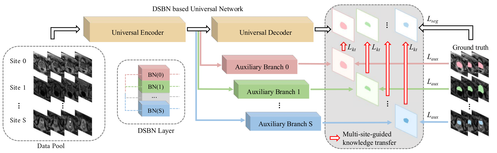

<p align="left">
    
</p>

[**_MS-Net: Multi-Site Network for Improving Prostate Segmentation with Heterogeneous MRI Data_**](https://arxiv.org/abs/2002.03366)

> we propose a novel multi-site network (MS-Net) for improving prostate segmentation by learning robust representations, leveraging multiple sources of data. To compensate for the inter-site heterogeneity of different MRI datasets, we develop Domain-Specific Batch Normalization layers in the network backbone, enabling the network to estimate statistics and perform feature normalization for each site separately. Considering the difficulty of capturing the shared knowledge from multiple datasets, a novel learning paradigm, i.e., Multi-site-guided Knowledge Transfer, is proposed to enhance the kernels to extract more generic representations from multi-site data. Extensive experiments on three heterogeneous prostate MRI datasets demonstrate that our MS-Net improves the performance across all datasets consistently. 

This is the reference implementation of the unpaired multi-modal segmentation method described in our paper:
```
@inproceedings{liu2020msnet,
    author = {Quande Liu and Qi Dou and Lequan Yu and Pheng Ann Heng},
    title = {MS-Net: Multi-Site Network for Improving Prostate Segmentation with Heterogeneous MRI Data},
    booktitle = {IEEE Transactions on Medical Imaging},
    year = {2020},
}
```

### Usage

1. Train the model:
  First, you need to specify the training configurations (can simply use the default setting) in main.py.
  Then run:
   ```shell
   python main.py --phase=train
   ```

2. Evaluate the model:

    Run:
   ```shell
   python main.py --phase=test --restore_model='xxxx'
   ```
   You will see the output results in the folder `./output/`.
   
### Questions

Please contact 'qdliu@cse.cuhk.edu.hk'

